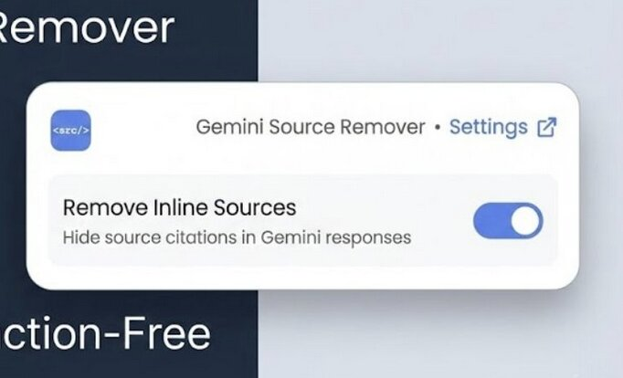

# GeminiStrip

A Chrome extension that strips away inline source citations on Google Gemini.

**GeminiStrip** gives you control over the inline source citations that appear in Gemini responses, allowing you to focus on the content without visual distractions.

---

## 🔍 What It Does

- **Toggle inline sources**: Hide or show source citations in Gemini responses with a simple switch
- **Non-destructive approach**: Uses CSS to hide elements rather than removing them, preserving Gemini's functionality
- **Real-time updates**: Changes take effect immediately without needing to refresh the page
- **Clean interface**: Beautiful popup UI inspired by modern design principles

---

## 🚀 How to Install (Chrome)

You'll need to enable **Developer Mode** to install GeminiStrip manually.

1. **Download or clone this repo** to your computer.

2. Open **Google Chrome** and go to:  
   `chrome://extensions`

3. In the top right corner, **turn on Developer Mode** (toggle switch).

4. Click **"Load unpacked"** and select the folder where you downloaded this project.

That's it! You should now see GeminiStrip in your list of extensions.

---

## 🎯 How to Use

1. **Navigate to Gemini**: Go to [gemini.google.com](https://gemini.google.com)
2. **Click the extension icon**: Click on the GeminiStrip icon in your Chrome toolbar
3. **Toggle the switch**: Use the toggle to enable or disable inline source removal
4. **See changes instantly**: Sources will immediately disappear or reappear on the current page

---

## 🧠 Why You'll Love It

- **Cleaner reading experience**: Focus on Gemini's responses without citation clutter
- **Preserves functionality**: Doesn't break Gemini's underlying framework or features
- **Simple and intuitive**: One-click toggle with no complicated settings
- **Reliable**: Uses CSS hiding instead of DOM manipulation for better compatibility

---

## 💡 Built for people who:

- Use Google Gemini regularly
- Prefer a cleaner, less cluttered interface
- Want to reduce visual distractions while reading
- Value simplicity and reliability

---

## 🔧 Technical Details

- **Approach**: Uses CSS `display: none !important` to hide `sources-carousel-inline` elements
- **Storage**: Saves user preference in Chrome's local storage
- **Compatibility**: Works with Gemini's Angular-based framework
- **Performance**: Lightweight and doesn't impact page load times

---

✨ No complicated setup. No confusing menus. GeminiStrip is built to stay out of your way and just work.

Made with ❤️ for a cleaner AI experience.
